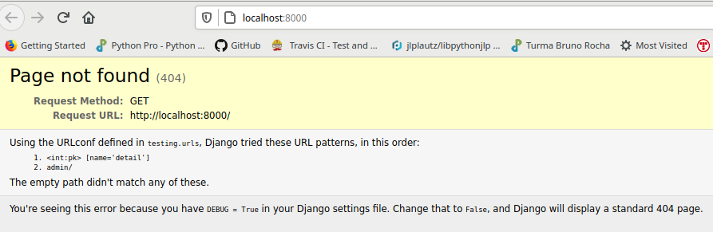
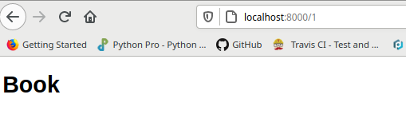
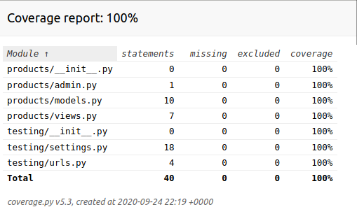

# djangotest
Django aplication with pytest procedure, oriented by The Dumbfounds .


[](https://pyup.io/repos/github/jlplautz/djangotest/)
[](https://pyup.io/repos/github/jlplautz/djangotest/)


## 1- Created a virtual environment
   - djangotest $ pyenv version
   - djangotest $ pyenv local 3.8.1
   - djangotest $ pipenv install django
   - djangotest $ pipenv install flake8 --dev
   - djangotest $ source .venv/bin/activate
   - (djangotest) djangotest $ pip freeze > requirements.txt
   - create a file .flake8
   ```
    [flake8]
    max-line-length = 120
    exclude = .venv
   ```
   - create a file .pyup.yml
   ```
    requirements:
      - Pipfile
      - Pipfile.lock
   ```

## 2- Created django project and products app
   - (djangotest) djangotest $ django-admin startproject testing .
   - (djangotest) djangotest $ mng startapp products
   ```
    (djangotest) djangotest $ pwd
    /home/plautz/PycharmProjects/djangotest
    (djangotest) djangotest $ tree
    .
    ├── LICENSE
    ├── manage.py
    ├── Pipfile
    ├── Pipfile.lock
    ├── products
    │   ├── admin.py
    │   ├── apps.py
    │   ├── __init__.py
    │   ├── migrations
    │   │   └── __init__.py
    │   ├── models.py
    │   ├── tests.py
    │   └── views.py
    ├── ,pyup.yml
    ├── README.md
    ├── requirements.txt
    └── testing
        ├── asgi.py
        ├── __init__.py
        ├── __pycache__
        │   ├── __init__.cpython-38.pyc
        │   └── settings.cpython-38.pyc
        ├── settings.py
        ├── urls.py
        └── wsgi.py
   ```

   - implemented models.py
   - implemented views.py
   - implemented testing/urls
   - (djangotest) djangotest $ mng makemigrations
   - (djangotest) djangotest $ mng migrate
   - (djangotest) djangotest $ mng runserver
   
   
   
   - (djangotest) djangotest $ mng shell
   ```
   >>> from products.models import Product
   >>> from datetime import datetime
   >>> Product.objects.create(name='Book', description='An Awesome book about Django', price=19.99, quantity=100, 
         published_on=datetime.now()).save()
   >>> Product.objects.get(pk=1)
      <Product: Product object (1)>
   ```   
   
   
## 3- Install pytest-django/ pytest-cov / mixer
   
   - (djangotest) djangotest $ pipenv install -d pytest-django
   - (djangotest) djangotest $ pipenv install -d 'pytest-cov'
   - (djangotest) djangotest $ pipenv install --dev mixer
   - create a file pytest.ini
   ```
    [pytest]
    DJANGO_SETTINGS_MODULE = testing.settings
   ```
   - The directory products/tests was created
     - file test_models.py
     - file test_urls,py
     - file test_views.py
   
   - to run test in terminal 
   ```
    djangotest) djangotest $ pytest
    ======================================== test session starts ============================
    platform linux -- Python 3.8.1, pytest-6.0.2, py-1.9.0, pluggy-0.13.1
    django: settings: testing.settings (from ini)
    rootdir: /home/plautz/PycharmProjects/djangotest, configfile: pytest.ini
    plugins: cov-2.10.1, django-3.10.0
    collected 5 items                                                                                                                                      

    products/tests/test_models.py ..                                                [ 40%]
    products/tests/test_views.py ..                                                 [ 80%]
    products/tests/test_urls.py .                                                   [100%]
    
    ========================================= 5 passed in 0.42s =============================
   ```           

## 4- Criar um setup para executar funçoes comum(evitar codigo duplicado)     
   - no test_views.py temos algumas linhas de codigo repetidos 
   - fazer import django.test -> TestCase
   - cria um função setUpClass
                                    
   ```
   (djangotest) djangotest $ pytest products --nomigrations --cov=products
   ============================================== test session starts =======================================
   platform linux -- Python 3.8.1, pytest-6.0.2, py-1.9.0, pluggy-0.13.1
   django: settings: testing.settings (from ini)
   rootdir: /home/plautz/PycharmProjects/djangotest, configfile: pytest.ini
   plugins: cov-2.10.1, django-3.10.0
   collected 5 items                                                                                                                                      
   
   products/tests/test_models.py ..                                                                   [ 40%]
   products/tests/test_views.py ..                                                                    [ 80%]
   products/tests/test_urls.py .                                                                      [100%]
   
   ----------- coverage: platform linux, python 3.8.1-final-0 -----------
   Name                                  Stmts   Miss  Cover
   ---------------------------------------------------------
   products/__init__.py                      0      0   100%
   products/admin.py                         0      0   100%
   products/apps.py                          3      3     0%
   products/migrations/0001_initial.py       5      5     0%
   products/migrations/__init__.py           0      0   100%
   products/models.py                       10      0   100%
   products/tests.py                         0      0   100%
   products/tests/test_models.py            11      0   100%
   products/tests/test_urls.py               5      0   100%
   products/tests/test_views.py             26      0   100%
   products/views.py                         7      0   100%
   ---------------------------------------------------------
   TOTAL                                    67      8    88%
   
   =============================================== 5 passed in 0.38s =========================================
   ```     
   - Modified file pytest.ini
   ```
    [pytest]
    DJANGO_SETTINGS_MODULE = testing.settings
    addopts = --cov --cov-report=html
   ```
   - created a file .coveragerc in the pŕoject root
   ```
    [run]
    omit = */tests/*
           */migrations/*
           */.venv/*
   ```
   
   

## 5- Create pytest fixture
   - into file test_views.py
   ```
     @pytest.fixture
     def factory():
          return RequestFactory()

     @pytest.fixture
     def product(db):
          return mixer.blend('products.Product')

     def test_product_detail_authenticated(factory, product):
          ...
     def test_product_detail_unauthenticated(factory, product):
          ...
   ```
   - into file test_models.py
   ```
     @pytest.fixture
     def product(request, db):
          return mixer.blend('products.Product', quantity=request.param)

     @pytest.mark.parametrize('product', [1], indirect=True)
          ...
     @pytest.mark.parametrize('product', [0], indirect=True)
          ...
   ```
